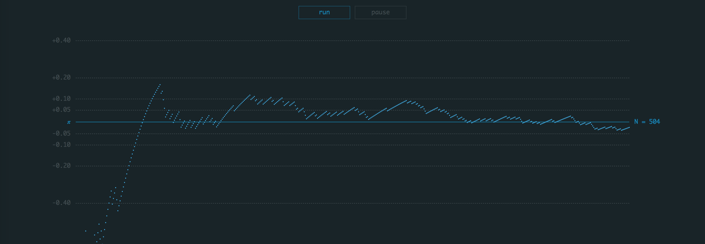
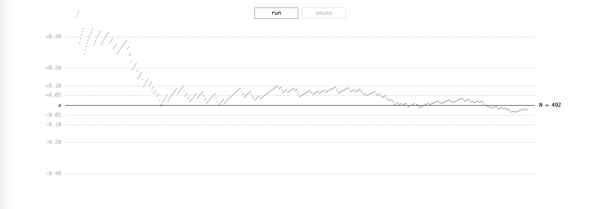

Pi Estimation
-------------

A simple example of an animated scatterplot using [D3.js](https://d3js.org/).





The chart is showing estimations of **𝜋** by using a Monte Carlo Method. The number of used iterations is shown as well.

For the sake of demonstration, the animation can be paused and resumed.

### Run

The example can be viewed by starting a local web server, for example, with:

```python
python3 -m http.server 4000
```

Then, in this case, you have to visit [http://localhost:4000](http://localhost:4000)